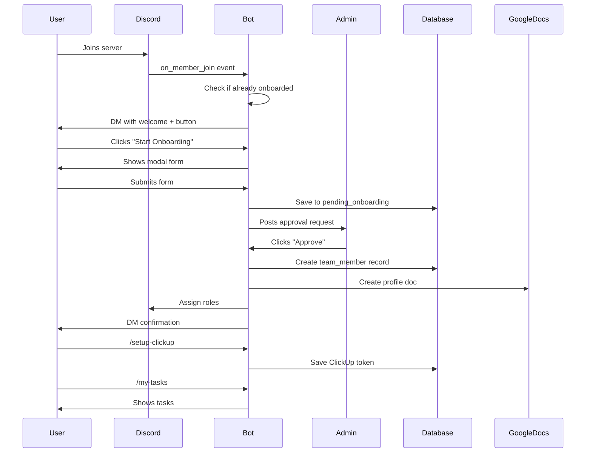

# Discord-First Onboarding System

Complete guide to the new automated onboarding flow for team members.

## Overview

The Alfred system now features a **Discord-first onboarding flow** that automates the entire process from when a user joins the Discord server to when they're fully integrated into the team.

### Key Features

- ✅ **Automated Welcome**: New members receive a welcome DM automatically
- ✅ **Interactive Forms**: Discord modals for easy data entry
- ✅ **Admin Approval**: Built-in approval workflow with buttons
- ✅ **Database Integration**: All data saved to PostgreSQL via Supabase
- ✅ **Google Docs**: Auto-generates team profile documents
- ✅ **Role Management**: Automatic Discord role assignment based on team/hierarchy
- ✅ **ClickUp Integration**: Users can connect ClickUp after onboarding

## User Flow



## Database Schema

### New Tables

#### `pending_onboarding`
Stores onboarding requests awaiting admin approval.

```sql
CREATE TABLE pending_onboarding (
    id UUID PRIMARY KEY,
    discord_id BIGINT NOT NULL,
    discord_username VARCHAR(100),
    name VARCHAR(255) NOT NULL,
    email VARCHAR(255) NOT NULL,
    role VARCHAR(50),
    team VARCHAR(100),
    bio TEXT,
    timezone VARCHAR(50),
    skills JSONB,
    status VARCHAR(20) DEFAULT 'pending',  -- pending, approved, rejected
    submitted_at TIMESTAMP,
    reviewed_at TIMESTAMP,
    reviewed_by UUID REFERENCES team_members(id),
    rejection_reason TEXT
);
```

#### `teams`
Organizational team structure.

```sql
CREATE TABLE teams (
    id UUID PRIMARY KEY,
    name VARCHAR(100) UNIQUE,
    description TEXT,
    team_lead_id UUID REFERENCES team_members(id),
    parent_team_id UUID REFERENCES teams(id),  -- For hierarchy
    discord_role_id BIGINT,
    created_at TIMESTAMP,
    updated_at TIMESTAMP
);
```

#### `roles`
Role definitions with hierarchy levels.

```sql
CREATE TABLE roles (
    id UUID PRIMARY KEY,
    name VARCHAR(50) UNIQUE,
    level INTEGER NOT NULL,  -- 1=IC, 2=Lead, 3=Manager, 4=Director, 5=Executive
    description TEXT,
    permissions JSONB,
    discord_role_id BIGINT,
    created_at TIMESTAMP
);
```

#### Enhanced `team_members`
Added new columns:

```sql
ALTER TABLE team_members ADD COLUMN discord_id BIGINT UNIQUE;
ALTER TABLE team_members ADD COLUMN role VARCHAR(50);
ALTER TABLE team_members ADD COLUMN team VARCHAR(100);
ALTER TABLE team_members ADD COLUMN manager_id UUID REFERENCES team_members(id);
ALTER TABLE team_members ADD COLUMN status VARCHAR(20) DEFAULT 'active';
ALTER TABLE team_members ADD COLUMN start_date DATE;
```

## Setup Instructions

### 1. Run Database Migration

```bash
# Connect to Supabase and run the migration
cd shared-services/database/migrations
psql $SUPABASE_CONNECTION_STRING -f 002_add_teams_and_hierarchy.sql
```

Or use Supabase dashboard:
1. Go to SQL Editor
2. Paste contents of `002_add_teams_and_hierarchy.sql`
3. Run

### 2. Configure Discord Admin Channel

Create a private channel in Discord for admin approvals:

1. In Discord, create a new text channel: `#admin-onboarding`
2. Make it private (only admins can see)
3. Right-click the channel → Copy ID
4. Add to `.env`:

```bash
DISCORD_ADMIN_CHANNEL_ID=1234567890123456789
```

### 3. Update Discord Bot Permissions

Make sure your bot has these intents enabled in Discord Developer Portal:

- ✅ Server Members Intent (required for `on_member_join`)
- ✅ Message Content Intent
- ✅ Presence Intent (optional)

### 4. Install Dependencies

```bash
cd discord-bot
uv pip install -e .
uv pip install -e ../shared-services/data-service
```

### 5. Run the Bot

```bash
./run.sh
```

## Usage Guide

### For New Team Members

1. **Join Discord Server**: Get invite link from admin
2. **Receive Welcome DM**: Bot automatically sends welcome message
3. **Click "Start Onboarding"**: Opens interactive form
4. **Fill Out Form**:
   - Full Name (required)
   - Work Email (required)
   - Role/Position (optional)
   - Team (optional)
   - Brief Bio (optional)
5. **Submit**: Request sent to admins
6. **Wait for Approval**: Receive DM when approved
7. **Complete Setup**: Use `/setup` to verify profile
8. **Connect ClickUp**: Use `/setup-clickup <token>` to integrate

### For Admins

1. **Monitor Admin Channel**: All requests appear in `#admin-onboarding`
2. **Review Request**: See user's submitted information
3. **Approve or Reject**:
   - Click ✅ **Approve** to accept
   - Click ❌ **Reject** to decline (must provide reason)
4. **Auto-Processing**:
   - Approved users marked in database
   - Users notified via DM
   - Next steps provided

### Admin Commands

Coming soon:
- `/admin-pending` - List all pending onboarding requests
- `/admin-approve <user>` - Manually approve a user
- `/admin-reject <user> <reason>` - Manually reject
- `/admin-assign-role <user> <role>` - Assign team role
- `/admin-assign-team <user> <team>` - Assign to team

## Discord Bot Commands

### Onboarding Commands

All commands work in DMs and channels (ephemeral responses):

#### `/setup`
Check your onboarding status and profile information.

```
User: /setup
Bot: ✅ Profile Found
     Welcome, John Doe!
     
     📧 Email: john@company.com
     💼 Role: Software Engineer
     👥 Team: Engineering
     ✅ ClickUp Integration: Connected
```

#### `/setup-clickup <token>`
Connect your ClickUp account.

```
User: /setup-clickup pk_123456_ABCDEF
Bot: ✅ ClickUp Connected
     Connected as: john_doe
     
     Next Steps:
     • Use /my-tasks to view your tasks
```

#### `/my-tasks`
View all your assigned ClickUp tasks across all teams.

```
User: /my-tasks
Bot: 📋 Your Tasks (15)
     All tasks assigned to you across your teams
     
     [Task details with status, priority, due dates...]
```

## Role Hierarchy

The system supports 5 hierarchy levels:

| Level | Role | Permissions | Discord Role |
|-------|------|-------------|--------------|
| 1 | Individual Contributor | View own tasks, update own tasks | Contributor |
| 2 | Team Lead | Assign tasks, view team | Team Lead |
| 3 | Manager | Manage team, approve tasks | Manager |
| 4 | Director | Approve onboarding, manage teams | Director |
| 5 | Executive | Full access, org management | Executive |

## Team Structure

Default teams (customizable):

- **Engineering**: Software development and technical infrastructure
- **Product**: Product management and design
- **Marketing**: Marketing and growth initiatives
- **Sales**: Sales and business development
- **Operations**: Operations and administrative functions

### Adding New Teams

```python
# In Supabase SQL Editor or via API
INSERT INTO teams (name, description) VALUES
('Customer Success', 'Customer support and success'),
('Finance', 'Financial planning and analysis');
```

## Customization

### Custom Onboarding Fields

Edit `discord-bot/bot/onboarding.py` to add more fields:

```python
class OnboardingModal(discord.ui.Modal):
    # Add new field
    phone = discord.ui.TextInput(
        label="Phone Number",
        placeholder="+1 (555) 123-4567",
        required=False
    )
```

### Custom Approval Logic

Add business logic in `approve()` method:

```python
async def approve(self, interaction, button):
    # Custom validation
    if not pending.email.endswith("@company.com"):
        await interaction.followup.send(
            "❌ Email must be a company email",
            ephemeral=True
        )
        return
    
    # Proceed with approval...
```

### Custom Welcome Messages

Edit the `on_member_join` event in `bot/bot.py`:

```python
embed = discord.Embed(
    title="👋 Welcome to Acme Corp!",
    description="Your custom welcome message here..."
)
```

## Troubleshooting

### Bot doesn't DM new members

**Cause**: User has DMs disabled or bot lacks permissions

**Solution**:
1. Check bot has "Send Messages" permission
2. User must enable DMs from server members
3. Fallback: Admin channel gets notification

### Approval buttons don't work

**Cause**: Bot restart cleared view state

**Solution**: Views need to be persistent. Add to `setup_hook()`:

```python
self.add_view(ApprovalView(...))  # Persist across restarts
```

### Database errors

**Cause**: Migration not run or RLS policies blocking

**Solution**:
1. Verify migration ran successfully
2. Check Supabase service role key is used (not anon key)
3. Review RLS policies in Supabase dashboard

### User already exists error

**Cause**: Trying to onboard someone already in database

**Solution**: Bot automatically checks and prevents this. If still occurs:
```sql
-- Check for existing user
SELECT * FROM team_members WHERE discord_id = 123456789;
```

## Next Steps

### Planned Features

1. **Automatic Team Member Creation**: Currently requires admin to create Supabase user manually
2. **Skill Matching**: AI-powered task suggestions based on skills
3. **Bulk Onboarding**: CSV import for multiple users
4. **Custom Workflows**: Team-specific onboarding checklists
5. **Analytics Dashboard**: Onboarding metrics and insights

### Integration Roadmap

- [ ] Slack bridge for cross-platform notifications
- [ ] GitHub team sync
- [ ] Google Workspace directory sync
- [ ] Automated equipment ordering
- [ ] IT provisioning workflows

## Migration from Streamlit

If you previously used the Streamlit onboarding app:

### Phase 1: Run Both Systems (Current)
- Keep Streamlit for detailed profiles
- Use Discord for quick onboarding
- Both systems write to same database

### Phase 2: Discord-Only (Recommended)
1. Migrate existing users to have `discord_id`
2. Deprecate Streamlit app
3. Discord becomes single entry point

### Migration Script

```python
# migrate_to_discord.py
from data_service import create_data_service

ds = create_data_service()
members = ds.list_team_members(limit=1000)

for member in members:
    if not member.discord_id:
        print(f"Manual action needed for {member.email}")
        print(f"  Ask them to join Discord and run /setup")
```

## Security Considerations

1. **PII Protection**: All onboarding data encrypted at rest (Supabase)
2. **Access Control**: RLS policies restrict who can view/edit
3. **Audit Trail**: All approvals logged with reviewer ID
4. **Token Security**: ClickUp tokens never logged or exposed
5. **DM Privacy**: All interactions ephemeral or DM-only

## Support

For issues or questions:
- Check logs: `journalctl -u alfred-bot -f`
- Discord: Tag @admin in server
- GitHub: Open issue at github.com/yourorg/alfred

---

**Last Updated**: 2025-12-10
**Version**: 2.0.0
**Contributors**: Alfred Bot Team
