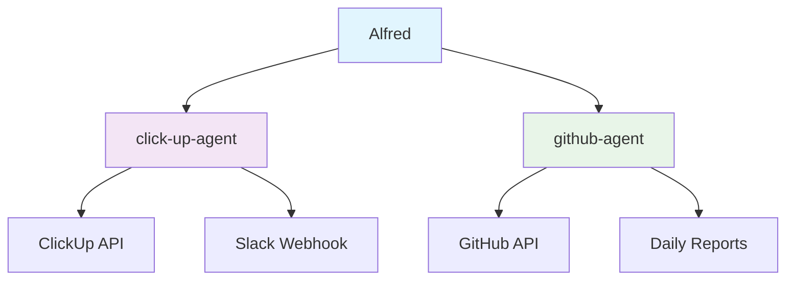

# Alfred

Digital butler to help run distributed teams through automation and integrations.

## Architecture

## Components

### click-up-agent
Syncs ClickUp task updates to Slack for team notifications.

### github-agent
Provides natural language interface for GitHub operations and generates daily reports.

## Setup

Each component has its own setup instructions. See individual README files in:
- `click-up-agent/README.md`
- `github-agent/README.md`