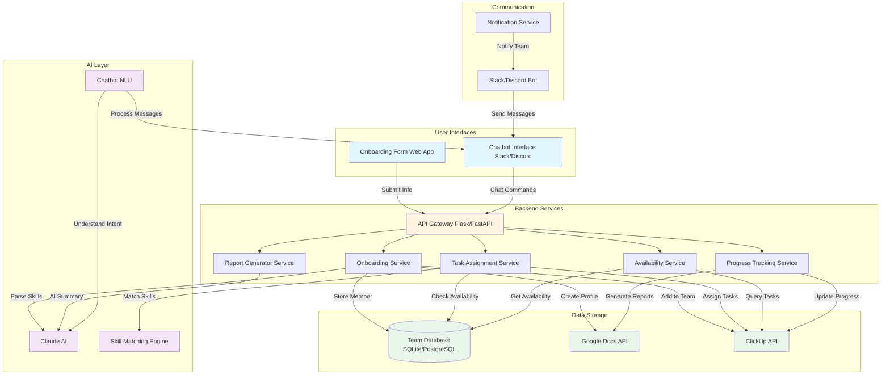

# Team Onboarding & Management System

## Overview

A comprehensive system for team member onboarding, task assignment, progress tracking, and team visibility through a chatbot interface.

## System Architecture



## Component Breakdown

### 1. User Interfaces

#### A. Onboarding Form (Simple Web App)
- **Technology**: Flask/Streamlit (simplest start)
- **Purpose**: Team members fill out onboarding form
- **Fields**:
  - Name, Email
  - Role (Developer, Designer, PM, etc.)
  - Skills (free text + multi-select)
  - Experience level per skill
  - Availability (hours/week)
  - Timezone
  - Preferred task types

#### B. Chatbot Interface
- **Technology**: Slack Bot / Discord Bot (you already have clients)
- **Purpose**: Main interface for daily interactions
- **Commands**:
  - `/my-tasks` - View assigned tasks
  - `/weekly-goals` - See weekly goals
  - `/update [task-id] [progress]` - Update task progress
  - `/availability` - Set availability
  - `/team-status` - See team availability
  - `/find-person [skill]` - Find team member with skill
  - `/help` - Show all commands

### 2. Backend Services

#### C. API Gateway
- **Technology**: FastAPI (recommended) or Flask
- **Purpose**: Route requests to appropriate services
- **Endpoints**:
  - `POST /onboard` - Handle new member onboarding
  - `POST /chat` - Process chatbot messages
  - `GET /team/availability` - Get team availability
  - `POST /tasks/assign` - Assign tasks to members
  - `GET /tasks/member/{id}` - Get member's tasks
  - `POST /tasks/update` - Update task progress

#### D. Onboarding Service
- **Responsibilities**:
  1. Receive onboarding form data
  2. Use Claude AI to parse skills and expertise
  3. Store member profile in database
  4. Create Google Doc profile
  5. Add member to ClickUp
  6. Send welcome message via chatbot

#### E. Task Assignment Service
- **Responsibilities**:
  1. Receive task requirements from PM
  2. Match skills with available team members
  3. Check member availability/workload
  4. Suggest best fit (AI-powered)
  5. Assign task in ClickUp
  6. Notify member via chatbot

#### F. Availability Service
- **Responsibilities**:
  1. Track member availability
  2. Calculate current workload
  3. Provide availability insights to PMs

#### G. Progress Tracking Service
- **Responsibilities**:
  1. Receive progress updates from chatbot
  2. Update ClickUp tasks
  3. Generate daily/weekly reports
  4. Store reports in Google Docs

#### H. Report Generator Service
- **Responsibilities**:
  1. Aggregate team progress
  2. Use Claude AI to summarize
  3. Create formatted Google Docs
  4. Send summary to Slack/Discord

### 3. AI Layer

#### I. Claude AI Integration
- **Use Cases**:
  - Parse skills from free-text onboarding
  - Summarize progress for reports
  - Power chatbot natural language understanding
  - Generate insights and recommendations

#### J. Skill Matching Engine
- **Algorithm**:
  1. Extract required skills from task
  2. Query database for members with skills
  3. Score members based on:
     - Skill match (0-100)
     - Experience level (0-100)
     - Current availability (0-100)
     - Past performance (optional)
  4. Return ranked list

#### K. Chatbot NLU
- **Functionality**:
  - Understand natural language commands
  - Extract intent and entities
  - Map to API calls
  - Format responses

### 4. Data Storage

#### L. Team Database
- **Technology**: Start with SQLite, migrate to PostgreSQL later
- **Tables**:
  - `team_members` (id, name, email, role, timezone, joined_date)
  - `skills` (id, member_id, skill_name, experience_level)
  - `availability` (id, member_id, hours_per_week, current_workload)
  - `task_assignments` (id, member_id, clickup_task_id, assigned_date)
  - `progress_logs` (id, member_id, task_id, update, timestamp)

#### M. Google Docs API
- **Purpose**: Document storage for reports and profiles
- **Documents**:
  - Team member profiles
  - Weekly progress reports
  - Project documentation

#### N. ClickUp API
- **Purpose**: Task management
- **Integration**:
  - Create/update tasks
  - Assign tasks to members
  - Track progress and time
  - Sync with local database

### 5. Communication

#### O. Slack/Discord Bot
- **Technology**: Slack Bolt SDK / Discord.py
- **Features**:
  - Respond to commands
  - Send notifications
  - Interactive messages (buttons/forms)

## Implementation Plan

### Phase 1: MVP (Weeks 1-2)

#### Week 1: Foundation
1. **Database Setup**
   - Create SQLite database
   - Define tables (team_members, skills, availability)
   - Write basic CRUD operations

2. **Onboarding Form**
   - Build simple Streamlit app
   - Form fields for member info
   - Store data in database

3. **Google Docs Integration**
   - Connect to Google Docs API (you already have client)
   - Auto-generate member profile doc
   - Template for profile format

4. **ClickUp Integration**
   - Extend existing ClickUp client
   - Add function to create team member custom field
   - Assign tasks to members

#### Week 2: Chatbot & Basic Commands
1. **Slack Bot Setup**
   - Extend existing Slack client
   - Set up bot with Slack Bolt SDK
   - Handle basic commands (`/my-tasks`, `/help`)

2. **Task Fetching**
   - Connect chatbot to ClickUp
   - Fetch tasks for user
   - Format and display in Slack

3. **Progress Updates**
   - Accept progress updates via chatbot
   - Update ClickUp tasks
   - Log updates in database

### Phase 2: Intelligence (Weeks 3-4)

#### Week 3: Skill Matching
1. **Skill Parser**
   - Use Claude to extract skills from onboarding
   - Normalize skill names
   - Store with confidence scores

2. **Availability Calculator**
   - Calculate current workload from ClickUp
   - Compare with member availability
   - Provide availability percentage

3. **Task Assignment Recommender**
   - Build skill matching algorithm
   - Score and rank team members
   - Return top 3 suggestions

#### Week 4: NLU Chatbot
1. **Natural Language Processing**
   - Integrate Claude for intent recognition
   - Handle conversational queries
   - Map to structured commands

2. **Weekly Goals Feature**
   - Sync with Google Docs goals
   - Show goals in chatbot
   - Track progress against goals

### Phase 3: Reporting & Automation (Week 5+)

1. **Automated Reports**
   - Daily standup summaries
   - Weekly progress reports
   - Generate and save to Google Docs
   - Share in Slack channels

2. **Team Dashboard**
   - Who's available right now
   - Who's overloaded
   - Skill distribution
   - Project status

3. **Advanced Features**
   - Task deadline reminders
   - Workload balancing alerts
   - Performance analytics

## Technology Stack

### Simplest Start (MVP)
- **Frontend**: Streamlit (onboarding form)
- **Backend**: FastAPI
- **Database**: SQLite
- **AI**: Claude API (Anthropic)
- **Chatbot**: Slack Bolt SDK
- **External APIs**: ClickUp, Google Docs
- **Hosting**: Local/Railway/Fly.io

### Scalable (Future)
- **Frontend**: React + Next.js
- **Backend**: FastAPI + Celery (async tasks)
- **Database**: PostgreSQL + Redis (caching)
- **AI**: Claude API + vector DB (for semantic search)
- **Chatbot**: Multi-platform (Slack + Discord + Teams)
- **Hosting**: AWS/GCP with containerization

## Data Flow Examples

### Example 1: New Member Onboarding
```
1. Member fills out Streamlit form
2. Form submits to /onboard API endpoint
3. Onboarding Service:
   - Stores data in database
   - Calls Claude to parse and categorize skills
   - Creates Google Doc profile from template
   - Adds member to ClickUp workspace
4. Welcome message sent via Slack bot
5. PM notified of new team member
```

### Example 2: Task Assignment
```
1. PM uses chatbot: "Who's available for a Python API task?"
2. Chatbot sends query to API Gateway
3. Task Assignment Service:
   - Queries database for members with "Python" and "API" skills
   - Checks ClickUp for current workload
   - Calculates availability scores
   - Returns ranked list
4. Chatbot displays: "Top 3 matches: Alice (95%), Bob (87%), Carol (72%)"
5. PM assigns task: "/assign [task-id] Alice"
6. Task created in ClickUp and Alice notified
```

### Example 3: Daily Progress Update
```
1. Team member: "/update #TASK-123 Completed API endpoint, writing tests"
2. Chatbot processes message
3. Progress Tracking Service:
   - Updates ClickUp task with comment
   - Logs progress in database
   - Updates task status if needed
4. Confirmation sent to member
5. Progress included in daily report
```

## File Structure

```
alfred/
├── team-management-system/
│   ├── api/
│   │   ├── main.py                    # FastAPI app
│   │   ├── routes/
│   │   │   ├── onboarding.py
│   │   │   ├── tasks.py
│   │   │   ├── chat.py
│   │   │   └── availability.py
│   │   └── middleware/
│   ├── services/
│   │   ├── onboarding_service.py
│   │   ├── task_assignment_service.py
│   │   ├── availability_service.py
│   │   ├── progress_tracking_service.py
│   │   └── report_generator_service.py
│   ├── ai/
│   │   ├── skill_parser.py
│   │   ├── skill_matcher.py
│   │   ├── chatbot_nlu.py
│   │   └── summarizer.py
│   ├── database/
│   │   ├── models.py                  # SQLAlchemy models
│   │   ├── database.py                # DB connection
│   │   └── migrations/
│   ├── chatbot/
│   │   ├── slack_bot.py               # Slack bot handlers
│   │   ├── discord_bot.py             # Discord bot handlers
│   │   ├── commands.py                # Command definitions
│   │   └── formatters.py              # Message formatting
│   ├── clients/                       # Reuse existing clients
│   │   ├── clickup_client.py
│   │   ├── gdrive_client.py
│   │   ├── slack_client.py
│   │   └── discord_client.py
│   ├── web/
│   │   └── onboarding_form.py         # Streamlit app
│   ├── templates/
│   │   ├── member_profile.md          # Google Doc template
│   │   └── weekly_report.md           # Report template
│   ├── config.py
│   ├── requirements.txt
│   └── README.md
```

## Environment Variables

```bash
# Database
DATABASE_URL=sqlite:///team_management.db

# APIs
ANTHROPIC_API_KEY=sk-ant-...
CLICKUP_API_TOKEN=pk_...
GOOGLE_CREDENTIALS_PATH=./creds/service-account.json

# Slack
SLACK_BOT_TOKEN=xoxb-...
SLACK_SIGNING_SECRET=...
SLACK_APP_TOKEN=xapp-...

# Discord (optional)
DISCORD_BOT_TOKEN=...

# Configuration
DEFAULT_WORKSPACE_ID=...
DEFAULT_LIST_ID=...
TEAM_PROFILE_FOLDER_ID=...  # Google Drive folder
```

## Key Design Decisions

### Why This Architecture?

1. **Separation of Concerns**: Each service handles one responsibility
2. **Scalability**: Can scale individual services independently
3. **Maintainability**: Easy to update one component without affecting others
4. **Extensibility**: Easy to add new platforms (Teams, Discord, etc.)

### Why Start Simple?

1. **SQLite → PostgreSQL**: Start simple, migrate when needed
2. **Streamlit → React**: Faster to prototype, can replace later
3. **Monolith → Microservices**: Begin as single app, split when scaling

### Why This Tech Stack?

1. **FastAPI**: Fast, modern, auto-generated docs
2. **SQLAlchemy**: ORM for easy database migrations
3. **Claude AI**: Best-in-class for text understanding and generation
4. **Slack/Discord**: Where teams already communicate

## Next Steps

1. Review this plan with your team
2. Set up development environment
3. Start with Phase 1, Week 1
4. Build incrementally and test with real users
5. Iterate based on feedback

## Cost Estimates

### MVP (Monthly)
- Claude API: ~$20-50 (depending on usage)
- Hosting (Railway/Fly.io): Free tier or ~$5
- Google Workspace: Existing
- ClickUp: Existing
- Slack: Free tier
- **Total: ~$25-55/month**

### Scaled (Monthly)
- Claude API: ~$200-500
- Database (Managed PostgreSQL): ~$25
- Hosting (AWS/GCP): ~$50-100
- Additional services: ~$50
- **Total: ~$325-675/month**
