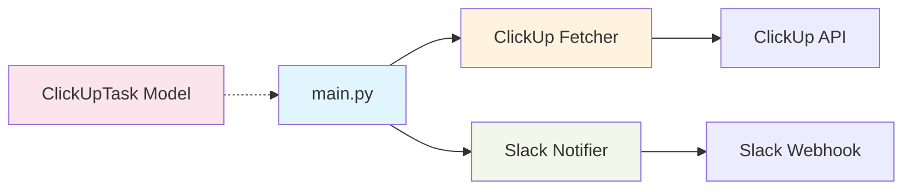

# Alfred

Digital butler to help run distributed teams. 

## Architecture



## Setup

1. Create a `.env` file based on `.env.example`:
   ```
   CLICKUP_API_TOKEN=your_clickup_api_token
   CLICKUP_LIST_ID=your_clickup_list_id
   SLACK_WEBHOOK_URL=your_slack_webhook_url
   ```

2. Install dependencies:
   ```bash
   pip install -r requirements.txt
   ```

3. Run the application:
   ```bash
   python main.py
   ```

## Structure

- `main.py` - Entry point and task formatting logic
- `models/task.py` - ClickUpTask Pydantic model
- `tools/clickup_fetcher.py` - ClickUp API integration
- `tools/slack_notifier.py` - Slack webhook integration

## Features

- Automatically syncs ClickUp task updates to Slack, keeping distributed teams informed without manual overhead. 

## Upcoming Features

- **Notion Integration**: Store and organize task documentation in Notion workspaces
- **GitHub Integration**: Sync task status with GitHub issues and pull requests