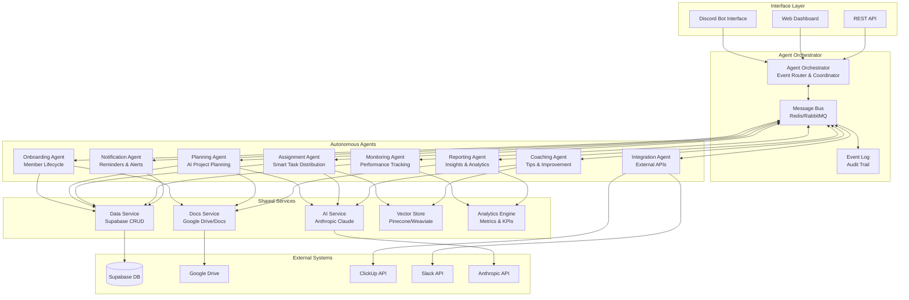
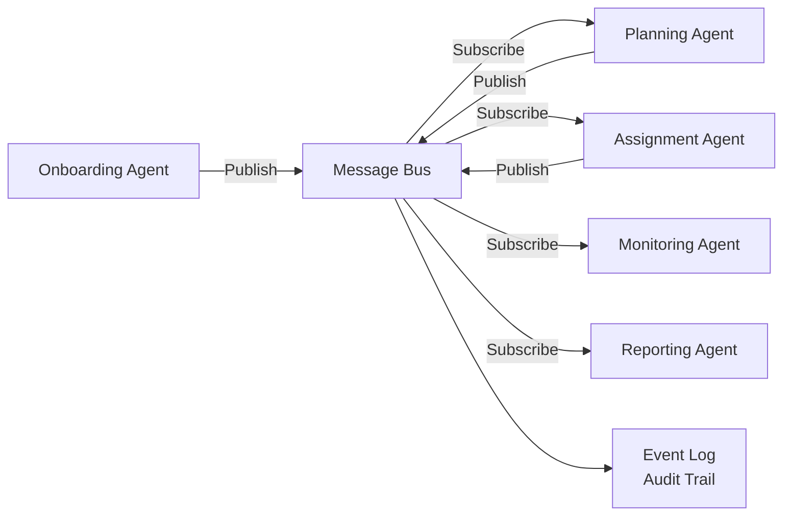
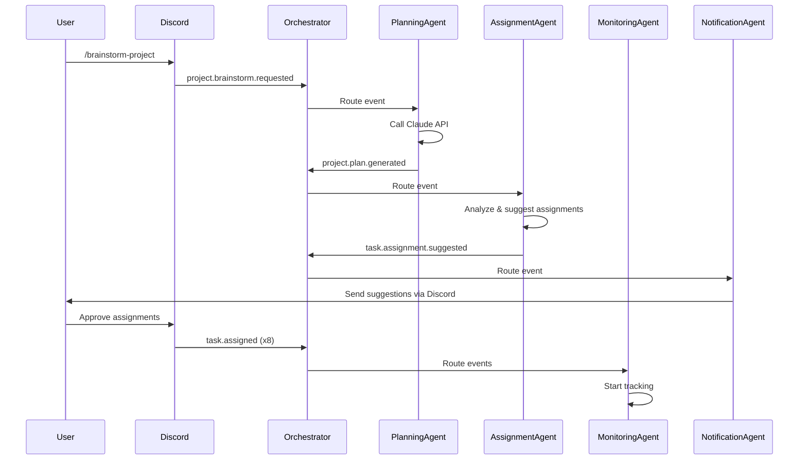

# Alfred Multi-Agent Architecture

**Vision**: Modular, autonomous agent system for complete team management lifecycle

---

## 🎯 Core Principles

1. **Agent Autonomy** - Each agent operates independently with clear responsibilities
2. **Event-Driven Communication** - Agents communicate through message bus (not direct calls)
3. **Modular & Testable** - Each agent can be developed, tested, and deployed separately
4. **Shared Knowledge Base** - Central database + vector store for agent coordination
5. **Human-in-the-Loop** - Critical decisions require human approval
6. **Observable & Debuggable** - All agent actions logged and traceable

---

## 🏗️ High-Level Architecture



---

## 🤖 Agent Definitions

### 1. **Onboarding Agent**
**Responsibility**: Complete member lifecycle from application to offboarding

**Events Consumed**:
- `member.application.submitted`
- `member.application.approved`
- `member.application.rejected`
- `member.offboarding.initiated`

**Events Published**:
- `member.created`
- `member.profile.created`
- `member.access.granted`
- `member.deactivated`

**Actions**:
- Create Supabase auth users
- Generate Google Doc profiles
- Update team rosters
- Assign Discord roles
- Trigger welcome workflows

**Dependencies**: DataService, DocsService

**Test Scenarios**:
```python
def test_onboarding_agent():
    # Mock event
    event = {
        "type": "member.application.approved",
        "data": {"discord_id": "123", "team": "Engineering"}
    }
    
    # Verify agent creates all resources
    result = onboarding_agent.handle(event)
    assert result["supabase_user_created"] == True
    assert result["google_doc_created"] == True
    assert result["discord_role_assigned"] == True
```

---

### 2. **Planning Agent** (AI-Powered)
**Responsibility**: Help leads plan projects with AI assistance

**Events Consumed**:
- `project.brainstorm.requested`
- `project.plan.created`
- `project.milestone.completed`

**Events Published**:
- `project.plan.generated`
- `project.tasks.created`
- `project.needs_assignment`

**Actions**:
- Call Anthropic API for project brainstorming
- Generate task breakdowns with dependencies
- Create Google Doc project briefs
- Create ClickUp lists and tasks
- Estimate timelines and resource needs

**AI Capabilities**:
- Natural language project descriptions → structured plans
- Context-aware task suggestions based on team history
- Risk identification and mitigation strategies
- Timeline optimization

**Dependencies**: AIService, DataService, DocsService, IntegrationAgent

**Test Scenarios**:
```python
def test_planning_agent_brainstorm():
    # Mock brainstorm request
    event = {
        "type": "project.brainstorm.requested",
        "data": {
            "name": "Q1 Competitor Analysis",
            "description": "Analyze top 5 competitors...",
            "team": "Business"
        }
    }
    
    # Verify AI generates structured plan
    result = planning_agent.handle(event)
    assert len(result["subtasks"]) >= 5
    assert result["timeline_weeks"] > 0
    assert result["analysis"] is not None
```

---

### 3. **Assignment Agent** (AI-Powered)
**Responsibility**: Smart task assignment based on skills, workload, and performance

**Events Consumed**:
- `project.needs_assignment`
- `task.created`
- `task.reassignment.requested`

**Events Published**:
- `task.assigned`
- `task.assignment.suggested`
- `member.overloaded.detected`

**Actions**:
- Match tasks to members based on:
  - Skills and expertise (vector similarity)
  - Current workload (active tasks)
  - Past performance (completion rate, quality)
  - Availability (calendar integration)
  - Learning goals (skill development)
- Detect overloaded members
- Suggest load balancing
- Track assignment accuracy over time

**AI Capabilities**:
- Semantic skill matching (NLP embeddings)
- Predictive task completion time
- Learning from past assignments
- Context-aware recommendations

**Dependencies**: AIService, VectorStore, DataService, Analytics

**Test Scenarios**:
```python
def test_assignment_agent_skill_matching():
    # Mock task needing assignment
    event = {
        "type": "task.created",
        "data": {
            "title": "Pricing strategy analysis",
            "description": "Analyze competitor pricing models...",
            "required_skills": ["pricing", "market analysis"]
        }
    }
    
    # Verify best match
    result = assignment_agent.handle(event)
    assert result["assignee"]["confidence"] > 0.8
    assert "pricing" in result["assignee"]["matching_skills"]
```

---

### 4. **Monitoring Agent** (Performance Tracking)
**Responsibility**: Continuous monitoring of team and individual performance

**Events Consumed**:
- `task.completed`
- `task.overdue`
- `project.deadline.approaching`
- `member.activity.logged`

**Events Published**:
- `performance.below_threshold`
- `performance.exceptional`
- `project.at_risk`
- `member.needs_support`

**Metrics Tracked**:
- **Individual**:
  - Task completion rate
  - Average completion time
  - Quality scores (from reviews)
  - Response time
  - Collaboration index
- **Team**:
  - Velocity (tasks/week)
  - Burndown rate
  - Bottleneck identification
  - Cross-functional collaboration
- **Project**:
  - Progress vs timeline
  - Budget tracking
  - Risk indicators

**Actions**:
- Real-time performance dashboards
- Anomaly detection (sudden drops)
- Trend analysis
- Predictive alerts (project might miss deadline)

**Dependencies**: Analytics, DataService

**Test Scenarios**:
```python
def test_monitoring_agent_detects_poor_performance():
    # Simulate member with low completion rate
    events = [
        {"type": "task.overdue", "member_id": "123"},
        {"type": "task.overdue", "member_id": "123"},
        {"type": "task.overdue", "member_id": "123"}
    ]
    
    # Verify alert triggered
    for event in events:
        monitoring_agent.handle(event)
    
    assert monitoring_agent.get_alerts()["123"]["type"] == "performance.below_threshold"
```

---

### 5. **Coaching Agent** (AI-Powered Improvement)
**Responsibility**: Proactive coaching and improvement suggestions

**Events Consumed**:
- `performance.below_threshold`
- `task.failed`
- `project.postmortem.completed`
- `member.struggling.detected`

**Events Published**:
- `coaching.tip.sent`
- `coaching.resource.shared`
- `coaching.check_in.scheduled`

**Actions**:
- Analyze performance patterns
- Generate personalized improvement tips
- Share relevant resources (docs, tutorials)
- Suggest mentorship pairings
- Track improvement over time

**AI Capabilities**:
- Pattern recognition in failure modes
- Personalized coaching based on history
- Resource recommendation (RAG from knowledge base)
- Empathetic communication

**Example Tips**:
```
🎯 Coaching Tip for @JohnDoe

I noticed your task completion rate dropped from 90% to 65% over the 
past 2 weeks. Here are some suggestions:

1. Break down large tasks (3/5 overdue tasks were >5 day estimates)
2. Set daily goals - members who do this complete 23% faster
3. Ask for help earlier - top performers ask questions within 6 hours

Resources:
📖 Task Breakdown Guide: [link]
🎥 Time Management Workshop: [link]

Would you like to schedule a check-in with your team lead?
[Yes] [Not now] [Send more tips]
```

**Dependencies**: AIService, VectorStore, DataService, MonitoringAgent

**Test Scenarios**:
```python
def test_coaching_agent_generates_tips():
    # Mock poor performance event
    event = {
        "type": "performance.below_threshold",
        "data": {
            "member_id": "123",
            "metric": "completion_rate",
            "value": 0.65,
            "threshold": 0.80,
            "pattern": "large_task_delays"
        }
    }
    
    # Verify personalized tip
    result = coaching_agent.handle(event)
    assert "break down" in result["tip"].lower()
    assert len(result["resources"]) > 0
```

---

### 6. **Reporting Agent**
**Responsibility**: Automated reports and insights

**Events Consumed**:
- `schedule.daily_report`
- `schedule.weekly_report`
- `project.completed`
- `quarter.ended`

**Events Published**:
- `report.generated`
- `insight.discovered`

**Actions**:
- Daily standup reports
- Weekly progress summaries
- Monthly team reviews
- Quarterly OKR tracking
- Custom report generation

**Report Types**:
- **Daily Standup**:
  - Yesterday's completions
  - Today's plan
  - Blockers
- **Weekly Summary**:
  - Velocity trends
  - Top performers
  - At-risk projects
- **Monthly Review**:
  - Team health metrics
  - Skill growth
  - Goal progress
- **Project Postmortem**:
  - What went well
  - What could improve
  - Lessons learned

**Dependencies**: Analytics, DocsService, DataService

---

### 7. **Notification Agent**
**Responsibility**: Smart, timely notifications

**Events Consumed**:
- `task.deadline.approaching`
- `task.assigned`
- `project.update.available`
- `coaching.tip.ready`
- `performance.milestone.reached`

**Events Published**:
- `notification.sent`
- `notification.acknowledged`

**Actions**:
- Send DMs to users
- Post to team channels
- Email digests
- Smart notification batching (avoid spam)
- Respect quiet hours
- Track notification effectiveness

**Smart Features**:
- Urgency-based prioritization
- User preference learning
- Digest mode for low-priority
- Snooze and remind
- Read receipts

**Dependencies**: DataService

---

### 8. **Integration Agent**
**Responsibility**: All external API integrations

**Events Consumed**:
- `clickup.task.create`
- `clickup.task.update`
- `slack.message.send`
- `calendar.event.create`

**Events Published**:
- `clickup.task.created`
- `clickup.task.synced`
- `external.api.error`

**Actions**:
- ClickUp CRUD operations
- Slack messaging
- Calendar integrations
- Webhook management
- API rate limiting
- Retry logic

**Why Separate?**:
- Isolate external dependencies
- Centralized API key management
- Easier testing (mock external APIs)
- Handle rate limits gracefully

**Dependencies**: ClickUp API, Slack API, etc.

---

## 📡 Event-Driven Communication

### Message Bus Architecture



### Event Schema

```typescript
interface Event {
  id: string;                    // Unique event ID
  type: string;                  // Event type (namespaced)
  timestamp: DateTime;           // When event occurred
  source: string;                // Which agent/system published
  data: object;                  // Event payload
  metadata: {
    correlation_id: string;      // For tracking event chains
    causation_id: string;        // What caused this event
    user_id?: string;            // User context
    trace_id: string;            // For distributed tracing
  };
}
```

### Example Event Flow



---

## 🗄️ Shared Knowledge Base

### Database Schema (Extended)

```sql
-- Projects
CREATE TABLE projects (
  id UUID PRIMARY KEY,
  name TEXT NOT NULL,
  description TEXT,
  team_id UUID REFERENCES teams(id),
  lead_member_id UUID REFERENCES team_members(id),
  status TEXT DEFAULT 'planning',
  priority TEXT,
  start_date DATE,
  end_date DATE,
  created_at TIMESTAMPTZ DEFAULT NOW()
);

-- Tasks
CREATE TABLE project_tasks (
  id UUID PRIMARY KEY,
  project_id UUID REFERENCES projects(id),
  title TEXT NOT NULL,
  description TEXT,
  assignee_id UUID REFERENCES team_members(id),
  status TEXT DEFAULT 'todo',
  priority TEXT,
  estimated_hours NUMERIC,
  actual_hours NUMERIC,
  depends_on UUID[],
  deadline DATE,
  created_at TIMESTAMPTZ,
  completed_at TIMESTAMPTZ
);

-- Performance Metrics
CREATE TABLE performance_metrics (
  id UUID PRIMARY KEY,
  member_id UUID REFERENCES team_members(id),
  metric_type TEXT NOT NULL, -- 'completion_rate', 'response_time', etc.
  value NUMERIC,
  period_start DATE,
  period_end DATE,
  calculated_at TIMESTAMPTZ DEFAULT NOW()
);

-- Agent Events (Event Sourcing)
CREATE TABLE agent_events (
  id UUID PRIMARY KEY,
  event_type TEXT NOT NULL,
  source_agent TEXT NOT NULL,
  data JSONB,
  metadata JSONB,
  correlation_id UUID,
  causation_id UUID,
  created_at TIMESTAMPTZ DEFAULT NOW()
);

-- Agent State (for stateful agents)
CREATE TABLE agent_state (
  agent_id TEXT PRIMARY KEY,
  state JSONB,
  last_heartbeat TIMESTAMPTZ,
  updated_at TIMESTAMPTZ DEFAULT NOW()
);

-- Coaching History
CREATE TABLE coaching_interactions (
  id UUID PRIMARY KEY,
  member_id UUID REFERENCES team_members(id),
  agent_id TEXT,
  interaction_type TEXT, -- 'tip', 'resource', 'check_in'
  content TEXT,
  effectiveness_score NUMERIC, -- Did it help?
  member_feedback TEXT,
  created_at TIMESTAMPTZ DEFAULT NOW()
);

-- Indexes for performance
CREATE INDEX idx_agent_events_type ON agent_events(event_type);
CREATE INDEX idx_agent_events_correlation ON agent_events(correlation_id);
CREATE INDEX idx_performance_metrics_member ON performance_metrics(member_id, metric_type);
CREATE INDEX idx_tasks_assignee ON project_tasks(assignee_id) WHERE status != 'completed';
```

### Vector Store (for AI Agents)

**Purpose**: Semantic search and similarity matching

**Collections**:
- `member_skills` - Skill embeddings for matching
- `task_descriptions` - Task similarity and recommendations
- `knowledge_base` - Documentation, best practices
- `past_projects` - Historical context for planning

**Example**:
```python
# Find members with similar skills
vector_store.search(
    collection="member_skills",
    query_vector=task_embedding,
    top_k=5,
    filters={"availability": "high"}
)
```

---

## 🔧 Modular Component Structure

```
alfred/
├── agent-framework/           # NEW: Core agent framework
│   ├── agent_framework/
│   │   ├── __init__.py
│   │   ├── base_agent.py     # Abstract Agent class
│   │   ├── orchestrator.py   # Event routing
│   │   ├── message_bus.py    # Redis/RabbitMQ wrapper
│   │   ├── event_log.py      # Audit trail
│   │   └── decorators.py     # @agent_handler, @schedule, etc.
│   └── tests/
│       └── test_framework.py
│
├── agents/                    # NEW: Individual agents
│   ├── onboarding-agent/
│   │   ├── onboarding_agent/
│   │   │   ├── __init__.py
│   │   │   ├── agent.py      # Main agent logic
│   │   │   └── handlers.py   # Event handlers
│   │   ├── tests/
│   │   │   └── test_onboarding.py
│   │   └── pyproject.toml
│   │
│   ├── planning-agent/
│   │   ├── planning_agent/
│   │   │   ├── agent.py
│   │   │   ├── handlers.py
│   │   │   └── prompts.py    # AI prompts
│   │   ├── tests/
│   │   └── pyproject.toml
│   │
│   ├── assignment-agent/
│   │   ├── assignment_agent/
│   │   │   ├── agent.py
│   │   │   ├── handlers.py
│   │   │   └── matching.py   # Skill matching logic
│   │   ├── tests/
│   │   └── pyproject.toml
│   │
│   ├── monitoring-agent/
│   │   ├── monitoring_agent/
│   │   │   ├── agent.py
│   │   │   ├── handlers.py
│   │   │   └── metrics.py    # Metric calculations
│   │   ├── tests/
│   │   └── pyproject.toml
│   │
│   ├── coaching-agent/
│   │   ├── coaching_agent/
│   │   │   ├── agent.py
│   │   │   ├── handlers.py
│   │   │   └── tips.py       # Tip generation
│   │   ├── tests/
│   │   └── pyproject.toml
│   │
│   ├── reporting-agent/
│   │   ├── reporting_agent/
│   │   │   ├── agent.py
│   │   │   ├── handlers.py
│   │   │   └── templates.py  # Report templates
│   │   ├── tests/
│   │   └── pyproject.toml
│   │
│   ├── notification-agent/
│   │   ├── notification_agent/
│   │   │   ├── agent.py
│   │   │   └── handlers.py
│   │   ├── tests/
│   │   └── pyproject.toml
│   │
│   └── integration-agent/
│       ├── integration_agent/
│       │   ├── agent.py
│       │   ├── handlers.py
│       │   ├── clickup.py
│       │   └── slack.py
│       ├── tests/
│       └── pyproject.toml
│
├── shared-services/           # EXISTING + ENHANCED
│   ├── data-service/         # Database CRUD
│   ├── docs-service/         # Google Drive/Docs
│   ├── ai-service/           # NEW: Anthropic API
│   ├── vector-service/       # NEW: Vector store
│   └── analytics-service/    # NEW: Metrics & KPIs
│
├── discord-bot/              # EXISTING: Discord interface
│   └── bot/
│       ├── bot.py            # Routes to orchestrator
│       └── commands/         # Slash commands
│
└── web-dashboard/            # NEW: Web interface
    ├── frontend/             # React/Next.js
    └── backend/              # FastAPI
```

---

## 🧪 Testing Strategy

### 1. **Unit Tests** (Each Agent)

```python
# agents/planning-agent/tests/test_planning_agent.py
import pytest
from unittest.mock import Mock
from planning_agent.agent import PlanningAgent

@pytest.fixture
def planning_agent():
    # Mock dependencies
    ai_service = Mock()
    data_service = Mock()
    return PlanningAgent(ai_service, data_service)

def test_brainstorm_generates_valid_plan(planning_agent):
    # Arrange
    event = {
        "type": "project.brainstorm.requested",
        "data": {
            "name": "Competitor Analysis",
            "description": "Analyze top 5 competitors",
            "team": "Business"
        }
    }
    
    planning_agent.ai_service.generate.return_value = {
        "subtasks": [{"title": "Task 1"}],
        "timeline_weeks": 4
    }
    
    # Act
    result = planning_agent.handle_brainstorm(event)
    
    # Assert
    assert len(result["subtasks"]) > 0
    assert result["timeline_weeks"] == 4
    assert result["status"] == "success"
```

### 2. **Integration Tests** (Agent + Services)

```python
# tests/integration/test_planning_flow.py
def test_full_planning_flow(test_db, real_ai_service):
    # Create planning agent with real AI service
    agent = PlanningAgent(real_ai_service, test_db)
    
    # Submit brainstorm request
    event = create_brainstorm_event()
    result = agent.handle_brainstorm(event)
    
    # Verify database updated
    project = test_db.get_project(result["project_id"])
    assert project is not None
    assert len(project.tasks) > 0
```

### 3. **End-to-End Tests** (Full System)

```python
# tests/e2e/test_project_creation.py
async def test_user_creates_project_end_to_end():
    # User submits via Discord
    await discord_client.send_command("/brainstorm-project")
    
    # Wait for AI processing
    await asyncio.sleep(2)
    
    # Verify planning agent generated plan
    plan = await get_latest_plan()
    assert plan is not None
    
    # User approves
    await discord_client.click_button("Create Project Plan")
    
    # Verify all systems updated
    assert await clickup_has_tasks(plan.id)
    assert await google_doc_exists(plan.id)
    assert await db_has_project(plan.id)
```

### 4. **Agent Behavior Tests**

```python
# Test agent handles failures gracefully
def test_coaching_agent_handles_ai_timeout():
    agent = CoachingAgent(slow_ai_service)
    
    event = create_coaching_request()
    result = agent.handle(event, timeout=5)
    
    # Should fallback to template tips
    assert result["status"] == "fallback"
    assert result["tip"] is not None
```

---

## 🚀 Deployment Strategy

### Development Mode
```bash
# Start all agents locally
docker-compose up

# Or individually for debugging
python -m agents.planning_agent
python -m agents.monitoring_agent
```

### Production Mode
```bash
# Each agent as separate container
kubectl apply -f k8s/agents/

# Auto-scaling based on event queue depth
# High-priority agents get more resources
```

### Agent Health Checks
```python
# Each agent exposes health endpoint
@agent.healthcheck
async def health():
    return {
        "agent": "planning-agent",
        "status": "healthy",
        "last_event": "2024-12-11T10:30:00Z",
        "queue_depth": 3,
        "dependencies": {
            "ai_service": "healthy",
            "data_service": "healthy"
        }
    }
```

---

## 📊 Observability

### Logging
```python
# Structured logging for all agents
logger.info(
    "event_handled",
    agent="planning-agent",
    event_type="project.brainstorm.requested",
    correlation_id="abc-123",
    duration_ms=1234,
    status="success"
)
```

### Metrics
```python
# Prometheus metrics
agent_events_handled.labels(agent="planning-agent", status="success").inc()
agent_event_duration.labels(agent="planning-agent").observe(1.234)
agent_ai_api_calls.labels(agent="planning-agent", model="claude").inc()
```

### Tracing
```python
# OpenTelemetry distributed tracing
with tracer.start_span("handle_brainstorm") as span:
    span.set_attribute("event_id", event.id)
    result = await ai_service.generate(prompt)
```

### Dashboards
- **Agent Overview**: Health, throughput, error rates
- **Event Flow**: Visualize event chains
- **Performance**: Response times, queue depths
- **AI Usage**: Token consumption, costs

---

## 🔐 Security Considerations

### 1. **Agent Permissions**
```python
# Each agent has limited permissions
AGENT_PERMISSIONS = {
    "planning-agent": [
        "projects:read",
        "projects:write",
        "tasks:write",
        "ai:generate"
    ],
    "monitoring-agent": [
        "metrics:read",
        "projects:read",
        "members:read"
    ],
    "coaching-agent": [
        "members:read",
        "notifications:send",
        "ai:generate"
    ]
}
```

### 2. **Event Validation**
```python
# Validate all events before processing
@agent.handler("project.brainstorm.requested")
def handle_brainstorm(event: Event):
    # Validate schema
    validate_event_schema(event, BrainstormRequestSchema)
    
    # Validate permissions
    if not has_permission(event.user_id, "project:create"):
        raise PermissionDenied()
    
    # Process...
```

### 3. **Rate Limiting**
```python
# Prevent abuse
@agent.handler("coaching.tip.requested")
@rate_limit(max_per_hour=10, per_user=True)
def handle_tip_request(event: Event):
    # Process...
```

---

## 🎯 Rollout Plan

### Phase 1: Foundation (Week 1-2)
- [ ] Build agent framework (BaseAgent, Orchestrator, MessageBus)
- [ ] Set up event logging and monitoring
- [ ] Create shared services (AI, Vector, Analytics)
- [ ] Database migrations

### Phase 2: Core Agents (Week 3-4)
- [ ] Refactor existing onboarding to agent pattern
- [ ] Build Planning Agent (with AI)
- [ ] Build Assignment Agent (with AI)
- [ ] Integration Agent (ClickUp, Slack)

### Phase 3: Intelligence Layer (Week 5-6)
- [ ] Monitoring Agent (performance tracking)
- [ ] Coaching Agent (AI tips and suggestions)
- [ ] Reporting Agent (automated reports)
- [ ] Notification Agent (smart notifications)

### Phase 4: Optimization (Week 7-8)
- [ ] Fine-tune AI prompts
- [ ] Optimize event routing
- [ ] Add caching and performance improvements
- [ ] Comprehensive testing

---

## 💡 Future Extensions

### More Agents
- **Hiring Agent** - Automate candidate screening and interviews
- **Learning Agent** - Personalized learning paths
- **Budget Agent** - Project cost tracking and forecasting
- **Risk Agent** - Proactive risk identification
- **Meeting Agent** - Schedule and summarize meetings

### Multi-Org Support
- White-label for different companies
- Org-specific agent configurations
- Shared learnings across orgs (privacy-preserving)

### Agent Collaboration
- Agents negotiate and coordinate
- Multi-agent consensus (e.g., hiring decisions)
- Agent learning from other agents

---

**Status**: Architecture Design Complete  
**Next Steps**: Begin Phase 1 implementation  
**Estimated Timeline**: 8 weeks to full multi-agent system  
**Priority**: Planning Agent + Monitoring Agent + Coaching Agent first
