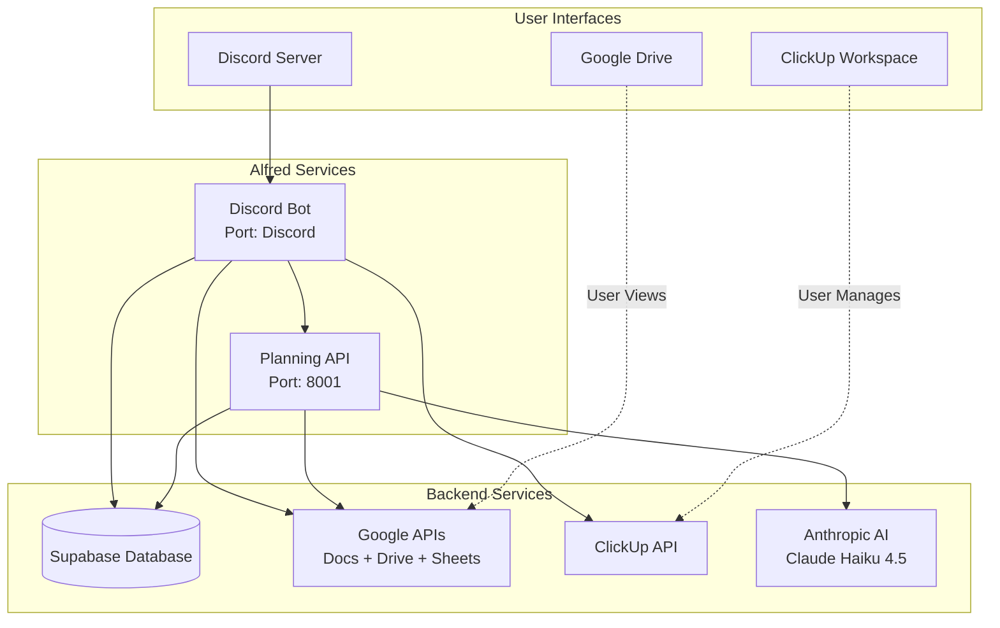
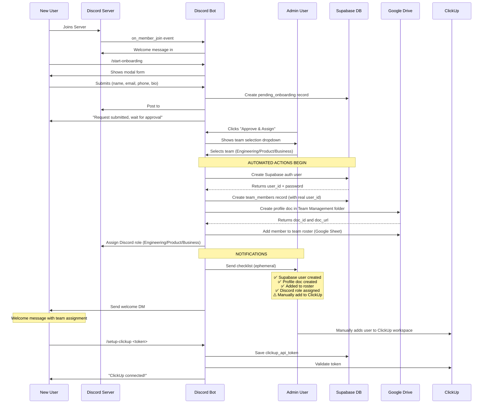
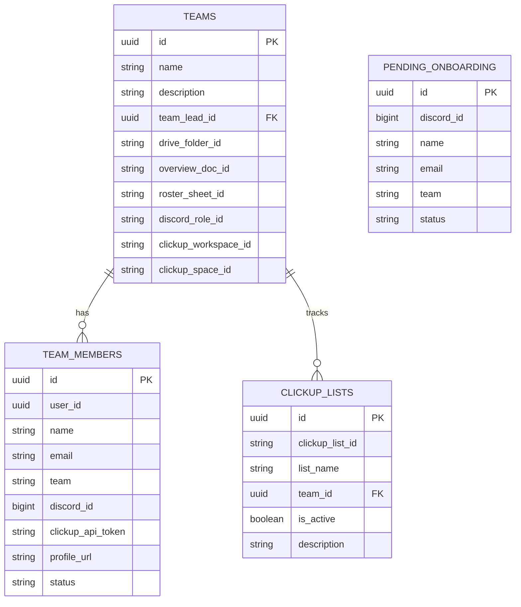
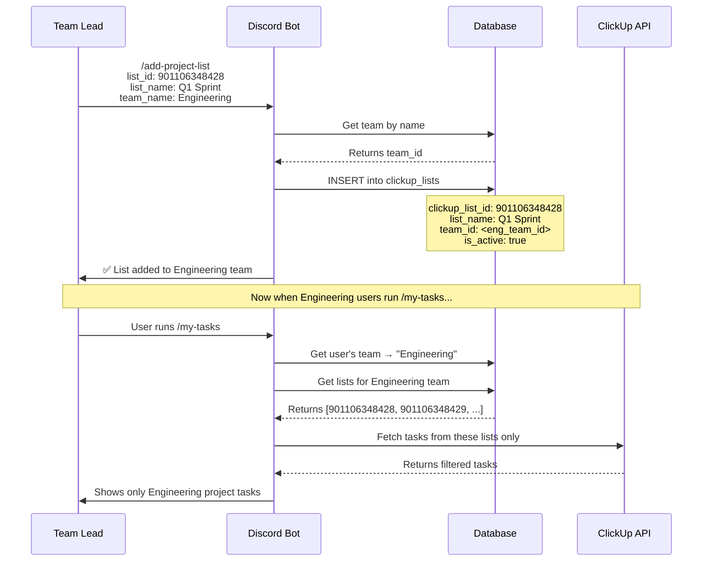
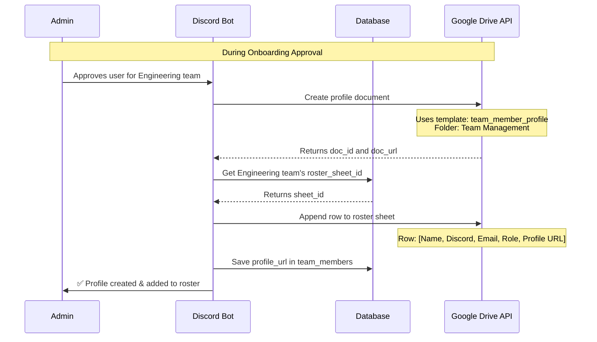
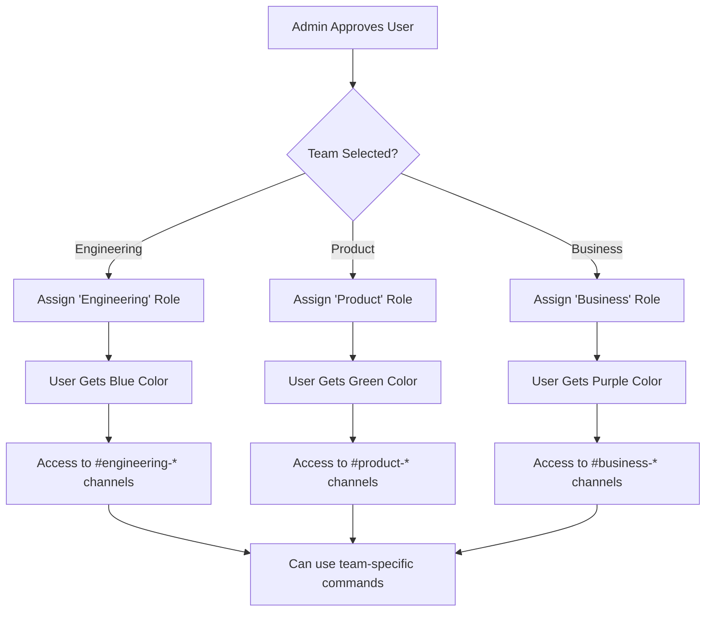
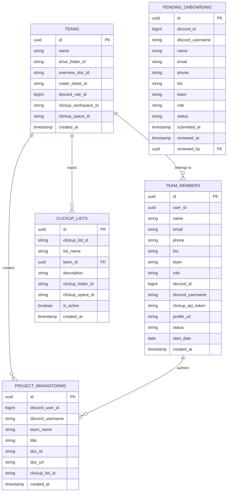
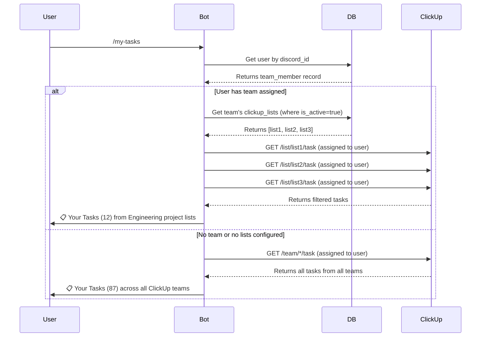
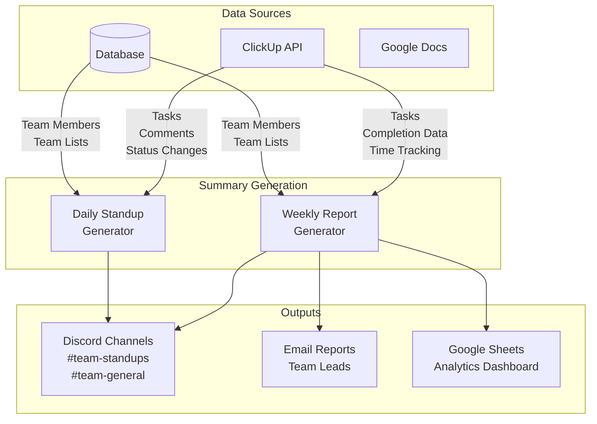

# Alfred System Architecture - Complete Guide

## Table of Contents
1. [System Overview](#system-overview)
2. [User Onboarding Flow](#user-onboarding-flow)
3. [Team Organization](#team-organization)
4. [ClickUp Integration](#clickup-integration)
5. [Google Drive Integration](#google-drive-integration)
6. [Discord Integration](#discord-integration)
7. [Database Schema](#database-schema)
8. [Data Flow Diagrams](#data-flow-diagrams)
9. [Daily/Weekly Summaries](#dailyweekly-summaries)

---

## System Overview

Alfred is a multi-service platform that integrates Discord, ClickUp, Google Drive, and Supabase to manage team onboarding, project planning, and task tracking.

### High-Level Architecture



---

## User Onboarding Flow

### Complete Onboarding Journey



### What Gets Populated in the Database

#### Step-by-Step Database Population

**1. Initial Request (User submits form)**
```sql
-- Table: pending_onboarding
INSERT INTO pending_onboarding (
    id,                    -- Auto-generated UUID
    discord_id,            -- User's Discord ID
    discord_username,      -- username#discriminator
    name,                  -- Full name from form
    email,                 -- Work email
    phone,                 -- Phone number (optional)
    bio,                   -- Skills & experience
    status,                -- 'pending'
    submitted_at           -- NOW()
);
```

**2. Admin Approval (Automated)**
```sql
-- A. Update pending request
UPDATE pending_onboarding 
SET 
    status = 'approved',
    team = 'Engineering',
    role = 'Software Engineer',
    reviewed_at = NOW(),
    reviewed_by = <admin_user_id>
WHERE id = <request_id>;

-- B. Create Supabase auth user (via Admin API)
-- Returns: user_id (UUID) and generated password

-- C. Create team member record
INSERT INTO team_members (
    id,                     -- user_id from Supabase
    user_id,                -- Same as id
    name,                   -- From pending_onboarding
    email,                  -- From pending_onboarding
    phone,                  -- From pending_onboarding
    bio,                    -- From pending_onboarding
    team,                   -- 'Engineering' (selected by admin)
    role,                   -- 'Software Engineer' (entered by admin)
    discord_id,             -- From pending_onboarding
    discord_username,       -- From pending_onboarding
    profile_url,            -- Google Doc URL (created)
    status,                 -- 'active'
    start_date,             -- TODAY
    created_at              -- NOW()
);
```

**3. User Setup (ClickUp Connection)**
```sql
-- Update team member with ClickUp token
UPDATE team_members 
SET clickup_api_token = <encrypted_token>
WHERE discord_id = <user_discord_id>;
```

### Database State After Onboarding

```
pending_onboarding table:
┌──────────────────────────────────┬────────────┬──────────┐
│ id                               │ status     │ name     │
├──────────────────────────────────┼────────────┼──────────┤
│ 123e4567-e89b-12d3-a456-42661... │ approved   │ John Doe │
└──────────────────────────────────┴────────────┴──────────┘

team_members table:
┌──────────────────────────────────┬──────────┬──────────────┬────────────┬─────────────┐
│ id (user_id)                     │ name     │ team         │ discord_id │ status      │
├──────────────────────────────────┼──────────┼──────────────┼────────────┼─────────────┤
│ abc12345-6789-...                │ John Doe │ Engineering  │ 9876543210 │ active      │
└──────────────────────────────────┴──────────┴──────────────┴────────────┴─────────────┘

teams table (pre-populated):
┌──────────────────────────────────┬─────────────┬───────────────────────┬──────────────────┐
│ id                               │ name        │ drive_folder_id       │ discord_role_id  │
├──────────────────────────────────┼─────────────┼───────────────────────┼──────────────────┤
│ team-eng-uuid                    │ Engineering │ folder123abc          │ 1234567890       │
│ team-prod-uuid                   │ Product     │ folder456def          │ 2345678901       │
│ team-biz-uuid                    │ Business    │ folder789ghi          │ 3456789012       │
└──────────────────────────────────┴─────────────┴───────────────────────┴──────────────────┘
```

---

## Team Organization

### Team Structure in Database



### How Teams Are Managed

**1. Team Creation (One-time Setup)**
```bash
# Run interactive setup script
python discord-bot/scripts/interactive_setup.py

# This creates:
# - Teams in database (Engineering, Product, Business)
# - Discord roles with colors
# - Google Drive folder structure
# - Team overview docs
# - Team roster spreadsheets
```

**2. Team Assignment (During Onboarding)**
- Admin selects team from dropdown
- User's `team_members.team` field is set
- Discord role is auto-assigned
- User added to team's Google Sheet roster
- User gets access to team channels (if configured)

**3. Team-Based Filtering**
```python
# When user runs /my-tasks
user_team = member.team  # "Engineering"
list_ids = get_team_list_ids_by_name(user_team)  # [list1, list2, list3]
tasks = clickup.get_all_tasks(list_ids=list_ids)  # Only team's tasks
```

---

## ClickUp Integration

### ClickUp Hierarchy

```
ClickUp Workspace
  └── Spaces
      └── Folders
          └── Lists ← We track these!
              └── Tasks
                  └── Subtasks
                  └── Comments
```

### How Lists Are Configured



### Task Tracking Flow

```mermaid
graph LR
    subgraph "User Commands"
        MyTasks[/my-tasks]
        TaskInfo[/task-info task_id]
        TaskComment[/task-comment task_id text]
    end
    
    subgraph "Filtering"
        GetTeam[Get user's team]
        GetLists[Get team's lists]
        FilterTasks[Filter to list_ids]
    end
    
    subgraph "ClickUp API"
        FetchTasks[GET /list/ID/task]
        FetchDetails[GET /task/ID]
        PostComment[POST /task/ID/comment]
    end
    
    MyTasks --> GetTeam
    GetTeam --> GetLists
    GetLists --> FilterTasks
    FilterTasks --> FetchTasks
    
    TaskInfo --> FetchDetails
    TaskComment --> PostComment
```

### Database: ClickUp Lists

```sql
-- Example data after configuration
clickup_lists table:
┌─────────────────┬───────────────────┬──────────────┬───────────┬──────────────┐
│ clickup_list_id │ list_name         │ team_id      │ is_active │ description  │
├─────────────────┼───────────────────┼──────────────┼───────────┼──────────────┤
│ 901106348428    │ Q1 Sprint         │ <eng_uuid>   │ true      │ Main sprint  │
│ 901106348429    │ Infrastructure    │ <eng_uuid>   │ true      │ DevOps work  │
│ 901106348430    │ Product Roadmap   │ <prod_uuid>  │ true      │ Product plan │
│ 901106348431    │ Old Q4 Sprint     │ <eng_uuid>   │ false     │ Archived     │
└─────────────────┴───────────────────┴──────────────┴───────────┴──────────────┘
```

---

## Google Drive Integration

### Folder Structure

```
📁 [Root Drive Folder]
├── 📁 Team Management/           ← All member profiles
│   ├── 📄 John Doe - Team Profile.gdoc
│   ├── 📄 Jane Smith - Team Profile.gdoc
│   └── 📄 ...
│
├── 📁 Engineering/               ← Team folder
│   ├── 📄 Engineering - Team Overview.gdoc
│   ├── 📊 Engineering - Active Team Members.gsheet
│   │   └── Rows: Name, Discord, Email, Role, Profile Link
│   └── 📁 [Project-specific folders can be added manually]
│
├── 📁 Product/
│   ├── 📄 Product - Team Overview.gdoc
│   ├── 📊 Product - Active Team Members.gsheet
│   └── ...
│
└── 📁 Business/
    ├── 📄 Business - Team Overview.gdoc
    ├── 📊 Business - Active Team Members.gsheet
    └── ...
```

### Document Creation Flow



### Database: Google Drive References

```sql
-- Teams table stores folder/doc IDs
teams table:
┌─────────────┬──────────────────┬──────────────────┬──────────────────┐
│ name        │ drive_folder_id  │ overview_doc_id  │ roster_sheet_id  │
├─────────────┼──────────────────┼──────────────────┼──────────────────┤
│ Engineering │ folder123abc     │ doc456def        │ sheet789ghi      │
│ Product     │ folder234bcd     │ doc567efg        │ sheet890hij      │
│ Business    │ folder345cde     │ doc678fgh        │ sheet901ijk      │
└─────────────┴──────────────────┴──────────────────┴──────────────────┘

-- Team members reference their profile doc
team_members table:
┌──────────┬────────────────────────────────────────────┐
│ name     │ profile_url                                │
├──────────┼────────────────────────────────────────────┤
│ John Doe │ https://docs.google.com/document/d/abc123  │
└──────────┴────────────────────────────────────────────┘
```

---

## Discord Integration

### Discord Server Structure

```
Discord Server: Alfred Team
│
├── 📢 #alfred                    ← Welcome & bot commands
├── 🔐 #admin-onboarding          ← Approval requests (admin only)
│
├── 👥 ENGINEERING
│   ├── #engineering-general      ← Team discussions
│   ├── #engineering-standups     ← Daily standups
│   └── #engineering-tasks        ← Task updates
│
├── 👥 PRODUCT
│   ├── #product-general
│   ├── #product-planning
│   └── #product-feedback
│
└── 👥 BUSINESS
    ├── #business-general
    └── #business-ops

Roles:
🔵 Engineering
🟢 Product
🟣 Business
🔴 Engineering Team Lead
🔴 Product Team Lead
🔴 Business Team Lead
```

### Discord Role Assignment



### Database: Discord Integration

```sql
-- Teams store Discord role IDs
teams table:
┌─────────────┬──────────────────┐
│ name        │ discord_role_id  │
├─────────────┼──────────────────┤
│ Engineering │ 1234567890123456 │
│ Product     │ 2345678901234567 │
│ Business    │ 3456789012345678 │
└─────────────┴──────────────────┘

-- Team members store Discord ID
team_members table:
┌──────────┬──────────────────┬───────────────────────┐
│ name     │ discord_id       │ discord_username      │
├──────────┼──────────────────┼───────────────────────┤
│ John Doe │ 987654321098765  │ johndoe#1234          │
└──────────┴──────────────────┴───────────────────────┘
```

---

## Database Schema

### Complete Entity Relationship



---

## Data Flow Diagrams

### Complete System Flow

```mermaid
flowchart TB
    subgraph "User Journey"
        U1[User Joins Discord] --> U2[/start-onboarding]
        U2 --> U3[Admin Approves]
        U3 --> U4[Auto: Create User]
        U4 --> U5[Auto: Assign Team]
        U5 --> U6[Auto: Create Docs]
        U6 --> U7[/setup-clickup]
        U7 --> U8[User Active]
    end
    
    subgraph "Admin Management"
        A1[/add-project-list] --> A2[Configure ClickUp Lists]
        A2 --> A3[Team Members See Filtered Tasks]
    end
    
    subgraph "Daily Operations"
        D1[/my-tasks] --> D2{Has Lists?}
        D2 -->|Yes| D3[Show Filtered Tasks]
        D2 -->|No| D4[Show All Tasks]
        
        D5[/task-info] --> D6[View Details]
        D7[/task-comment] --> D8[Post Update]
        
        D9[/brainstorm] --> D10[AI Planning]
        D10 --> D11[Create Google Doc]
    end
    
    U8 -.-> D1
    A3 -.-> D2
```

### Task Retrieval Flow



---

## Daily/Weekly Summaries

### How to Generate Summaries

#### 1. **Daily Standup Summary**

```python
# Pseudocode for daily summary

def generate_daily_summary(team_name, date):
    """Generate daily standup summary for a team"""
    
    # 1. Get team members
    members = db.get_team_members(team=team_name, status='active')
    
    # 2. Get team's ClickUp lists
    lists = db.get_team_clickup_lists_by_name(team_name)
    list_ids = [lst['clickup_list_id'] for lst in lists]
    
    # 3. For each member, get their tasks
    summary = {
        'team': team_name,
        'date': date,
        'members': []
    }
    
    for member in members:
        clickup = ClickUpService(member.clickup_api_token)
        
        # Get tasks assigned to this member from team lists
        tasks = clickup.get_all_tasks(
            assigned_only=True,
            list_ids=list_ids
        )
        
        # Categorize tasks
        completed_today = [t for t in tasks 
                          if t['status'] == 'done' 
                          and was_completed_today(t, date)]
        
        in_progress = [t for t in tasks 
                      if t['status'] in ['in progress', 'review']]
        
        blocked = [t for t in tasks 
                  if has_blocker_tag(t)]
        
        # Get comments from today
        today_comments = []
        for task in tasks:
            comments = clickup.get_task_comments(task['id'])
            today_comments.extend([c for c in comments 
                                  if was_posted_today(c, date)])
        
        summary['members'].append({
            'name': member.name,
            'completed_today': completed_today,
            'in_progress': in_progress,
            'blocked': blocked,
            'comments_today': today_comments
        })
    
    return format_daily_summary(summary)

def format_daily_summary(summary):
    """Format as Discord embed"""
    embed = discord.Embed(
        title=f"📅 {summary['team']} Daily Standup - {summary['date']}",
        color=discord.Color.blue()
    )
    
    for member_data in summary['members']:
        field_value = ""
        
        if member_data['completed_today']:
            field_value += f"✅ Completed: {len(member_data['completed_today'])} tasks\n"
        
        if member_data['in_progress']:
            tasks_str = ", ".join([t['name'][:30] for t in member_data['in_progress'][:3]])
            field_value += f"🔄 In Progress: {tasks_str}\n"
        
        if member_data['blocked']:
            field_value += f"⚠️ Blocked: {len(member_data['blocked'])} tasks\n"
        
        if member_data['comments_today']:
            field_value += f"💬 {len(member_data['comments_today'])} updates posted\n"
        
        embed.add_field(
            name=member_data['name'],
            value=field_value or "No activity today",
            inline=False
        )
    
    return embed
```

**Discord Command to Trigger**:
```python
@bot.tree.command(name="daily-standup")
async def daily_standup(interaction: discord.Interaction, team_name: str):
    """Generate daily standup summary for a team"""
    summary = generate_daily_summary(team_name, datetime.now().date())
    await interaction.response.send_message(embed=summary)
```

**Example Output**:
```
📅 Engineering Daily Standup - 2024-12-13

John Doe
✅ Completed: 3 tasks
🔄 In Progress: Implement OAuth, Fix bug #123, Update docs
💬 5 updates posted

Jane Smith
✅ Completed: 2 tasks
🔄 In Progress: Code review, Testing
⚠️ Blocked: 1 task

Alex Chen
🔄 In Progress: Database migration, API endpoint
💬 3 updates posted
```

---

#### 2. **Weekly Progress Summary**

```python
def generate_weekly_summary(team_name, week_start, week_end):
    """Generate weekly progress summary"""
    
    members = db.get_team_members(team=team_name, status='active')
    lists = db.get_team_clickup_lists_by_name(team_name)
    list_ids = [lst['clickup_list_id'] for lst in lists]
    
    # Aggregate stats for the week
    summary = {
        'team': team_name,
        'week_start': week_start,
        'week_end': week_end,
        'total_completed': 0,
        'total_created': 0,
        'avg_completion_time': 0,
        'top_contributors': [],
        'project_progress': {}
    }
    
    all_tasks = []
    for member in members:
        clickup = ClickUpService(member.clickup_api_token)
        tasks = clickup.get_all_tasks(list_ids=list_ids)
        
        # Track completed tasks this week
        completed = [t for t in tasks 
                    if was_completed_in_week(t, week_start, week_end)]
        
        summary['total_completed'] += len(completed)
        summary['top_contributors'].append({
            'name': member.name,
            'completed': len(completed)
        })
        
        all_tasks.extend(tasks)
    
    # Calculate project progress per list
    for list_info in lists:
        list_tasks = [t for t in all_tasks 
                     if t.get('list', {}).get('id') == list_info['clickup_list_id']]
        
        total = len(list_tasks)
        completed = len([t for t in list_tasks if t['status']['status'] == 'done'])
        
        summary['project_progress'][list_info['list_name']] = {
            'total': total,
            'completed': completed,
            'percentage': (completed / total * 100) if total > 0 else 0
        }
    
    # Sort top contributors
    summary['top_contributors'].sort(key=lambda x: x['completed'], reverse=True)
    
    return format_weekly_summary(summary)

def format_weekly_summary(summary):
    """Format as Discord embed with charts"""
    embed = discord.Embed(
        title=f"📊 {summary['team']} Weekly Report",
        description=f"{summary['week_start']} to {summary['week_end']}",
        color=discord.Color.green()
    )
    
    # Overall stats
    embed.add_field(
        name="📈 Overall Progress",
        value=f"✅ {summary['total_completed']} tasks completed this week",
        inline=False
    )
    
    # Top contributors
    top_3 = summary['top_contributors'][:3]
    contributors_text = "\n".join([
        f"{i+1}. {c['name']}: {c['completed']} tasks"
        for i, c in enumerate(top_3)
    ])
    embed.add_field(
        name="🏆 Top Contributors",
        value=contributors_text,
        inline=True
    )
    
    # Project progress
    for project, stats in summary['project_progress'].items():
        progress_bar = create_progress_bar(stats['percentage'])
        embed.add_field(
            name=f"📋 {project}",
            value=f"{progress_bar} {stats['percentage']:.0f}%\n"
                  f"{stats['completed']}/{stats['total']} tasks completed",
            inline=False
        )
    
    return embed

def create_progress_bar(percentage, length=10):
    """Create a visual progress bar"""
    filled = int(length * percentage / 100)
    return '▓' * filled + '░' * (length - filled)
```

**Example Output**:
```
📊 Engineering Weekly Report
Dec 7 - Dec 13, 2024

📈 Overall Progress
✅ 47 tasks completed this week

🏆 Top Contributors
1. John Doe: 18 tasks
2. Jane Smith: 15 tasks
3. Alex Chen: 14 tasks

📋 Q1 Engineering Sprint
▓▓▓▓▓▓▓░░░ 68%
34/50 tasks completed

📋 Backend Infrastructure
▓▓▓▓▓▓▓▓▓░ 85%
17/20 tasks completed
```

---

#### 3. **Automated Schedule** (Future Implementation)

```python
# Using a scheduler like APScheduler

from apscheduler.schedulers.asyncio import AsyncIOScheduler

scheduler = AsyncIOScheduler()

# Daily standup at 9 AM
@scheduler.scheduled_job('cron', hour=9, minute=0, day_of_week='mon-fri')
async def post_daily_standup():
    for team in ['Engineering', 'Product', 'Business']:
        channel = bot.get_channel(team_standup_channels[team])
        summary = generate_daily_summary(team, datetime.now().date())
        await channel.send(embed=summary)

# Weekly report on Friday at 5 PM
@scheduler.scheduled_job('cron', day_of_week='fri', hour=17, minute=0)
async def post_weekly_report():
    week_start = get_monday_of_week()
    week_end = datetime.now().date()
    
    for team in ['Engineering', 'Product', 'Business']:
        channel = bot.get_channel(team_general_channels[team])
        summary = generate_weekly_summary(team, week_start, week_end)
        await channel.send(embed=summary)

scheduler.start()
```

---

### Data Sources for Summaries



---

## Summary

### Key Takeaways

1. **Onboarding**: Fully automated from Discord form to database, Google Drive, and role assignment
2. **Team Organization**: Teams have dedicated folders, rosters, and ClickUp list tracking
3. **Task Scoping**: Users only see tasks from their team's configured project lists
4. **Integration Points**: 
   - Discord (user interface)
   - Supabase (data storage)
   - Google Drive (documentation)
   - ClickUp (task management)
   - Anthropic AI (project planning)

5. **Data Flow**: User → Discord → Bot → Database → External APIs → Back to User

6. **Summaries**: Can be generated by querying team members' tasks from configured lists and aggregating metrics

---

## Next Steps to Implement Summaries

1. **Create summary generation functions** (as shown above)
2. **Add Discord commands**: `/daily-standup`, `/weekly-report`
3. **Set up scheduler** for automated posting
4. **Create dedicated channels**: `#engineering-standups`, `#product-standups`
5. **Add analytics**: Track trends over time, velocity, completion rates

This architecture supports all the data needed for comprehensive team summaries! 🎯
