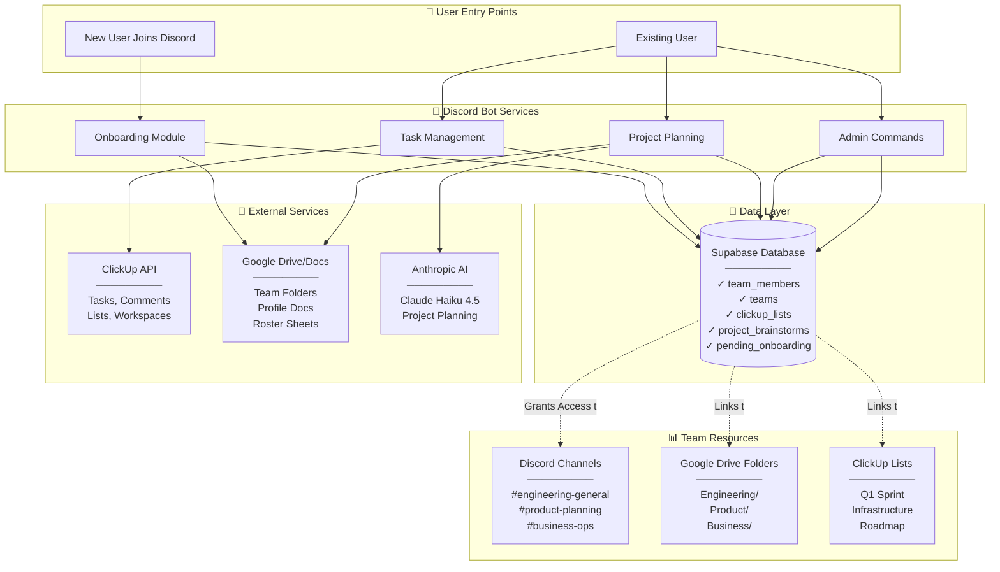
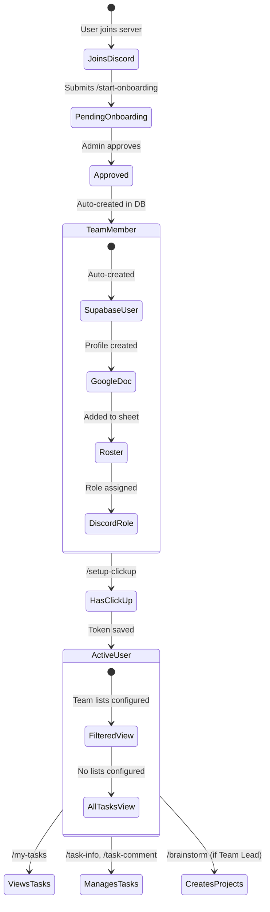

# Alfred System - Quick Visual Overview

## Complete System Map



---

## User Lifecycle



---

## Data Relationships

```mermaid
graph LR
    User[User] -->|belongs to| Team[Team]
    Team -->|has| Folder[Google Drive Folder]
    Team -->|tracks| Lists[ClickUp Lists]
    Team -->|has| Role[Discord Role]
    
    User -->|has| Profile[Google Doc Profile]
    User -->|has| Token[ClickUp API Token]
    User -->|creates| Projects[Project Brainstorms]
    
    Lists -->|contains| Tasks[ClickUp Tasks]
    Tasks -->|shown in| MyTasks[/my-tasks command]
    
    Profile -->|linked in| Roster[Team Roster Sheet]
    Roster -->|in| Folder
    
    Projects -->|creates| PlanDoc[Google Doc Plan]
    PlanDoc -->|saved in| Folder
```

---

## Command Flow Map

### User Commands

```mermaid
graph TD
    subgraph "Onboarding"
        C1[/start-onboarding] --> Modal[Fill Form]
        Modal --> Pending[Wait for Approval]
    end
    
    subgraph "Setup"
        C2[/setup] --> Profile[View Profile]
        C3[/setup-clickup] --> Connect[Connect ClickUp]
    end
    
    subgraph "Task Management"
        C4[/my-tasks] --> Filter{Team Lists?}
        Filter -->|Yes| Filtered[Show Filtered Tasks]
        Filter -->|No| All[Show All Tasks]
        
        C5[/task-info] --> Details[Show Task Details]
        C6[/task-comment] --> Comment[Post Comment]
    end
    
    subgraph "Project Planning - Team Leads"
        C7[/brainstorm] --> AI[AI Analysis]
        AI --> Doc[Create Google Doc]
        
        C8[/my-projects] --> ProjectList[List Projects]
    end
    
    subgraph "Admin Only"
        C9[/add-project-list] --> AddList[Add List to Team]
        C10[/list-project-lists] --> ShowLists[Show Team Lists]
        C11[/remove-project-list] --> RemoveList[Deactivate List]
    end
    
    style C7 fill:#ff9
    style C8 fill:#ff9
    style C9 fill:#f99
    style C10 fill:#f99
    style C11 fill:#f99
```

---

## Team Structure

```
ALFRED ORGANIZATION
│
├── ENGINEERING TEAM
│   ├── Members
│   │   ├── John Doe (Team Lead)
│   │   ├── Jane Smith
│   │   └── Alex Chen
│   │
│   ├── Discord
│   │   ├── Role: 🔵 Engineering
│   │   ├── Channels: #engineering-general, #engineering-standups
│   │   └── Access: Team-specific commands
│   │
│   ├── Google Drive
│   │   ├── Folder: Engineering/
│   │   ├── Doc: Team Overview
│   │   └── Sheet: Active Team Members Roster
│   │
│   └── ClickUp
│       ├── Lists: Q1 Sprint, Infrastructure, Tech Debt
│       └── Scoping: Only these lists shown in /my-tasks
│
├── PRODUCT TEAM
│   └── [Similar structure]
│
└── BUSINESS TEAM
    └── [Similar structure]
```

---

## Database Tables Quick Reference

```
┌─────────────────────┐
│   TEAMS             │
├─────────────────────┤
│ id                  │
│ name                │◄────┐
│ drive_folder_id     │     │
│ roster_sheet_id     │     │
│ discord_role_id     │     │
└─────────────────────┘     │
                            │
┌─────────────────────┐     │
│  TEAM_MEMBERS       │     │
├─────────────────────┤     │
│ id (user_id)        │     │
│ name                │     │
│ email               │     │
│ team ───────────────┼─────┘
│ discord_id          │
│ clickup_api_token   │
│ profile_url         │
│ status              │
└─────────────────────┘
        │
        │
┌───────┴─────────────┐
│  CLICKUP_LISTS      │
├─────────────────────┤
│ id                  │
│ clickup_list_id     │
│ list_name           │
│ team_id ────────────┼─────┐
│ is_active           │     │
└─────────────────────┘     │
                            │
┌─────────────────────┐     │
│ PROJECT_BRAINSTORMS │     │
├─────────────────────┤     │
│ id                  │     │
│ discord_user_id     │     │
│ team_name ──────────┼─────┘
│ title               │
│ doc_id              │
│ doc_url             │
└─────────────────────┘
```

---

## Integration Points

### What Connects Where

**Discord → Database**
- User profiles (team_members)
- Onboarding requests (pending_onboarding)
- Team associations

**Discord → ClickUp**
- Fetch tasks (/my-tasks)
- Get task details (/task-info)
- Post comments (/task-comment)

**Discord → Google Drive**
- Create profile docs (onboarding)
- Update team rosters (onboarding)
- Create project plans (/brainstorm)

**Database → ClickUp**
- Filter tasks by team lists
- Scope user views

**Database → Google Drive**
- Store folder IDs (teams table)
- Store doc URLs (team_members table)

**Database → Discord**
- Role assignments (discord_role_id)
- User linking (discord_id)

---

## Key Files & Locations

```
alfred/
│
├── discord-bot/
│   ├── bot/
│   │   ├── bot.py                    ← Main bot
│   │   ├── onboarding.py             ← User onboarding
│   │   ├── task_management.py        ← Task commands
│   │   ├── project_planning.py       ← AI planning (HTTP client)
│   │   ├── admin_commands.py         ← List management
│   │   └── services.py               ← ClickUp, Google APIs
│   │
│   └── scripts/
│       └── interactive_setup.py      ← Team setup wizard
│
├── project-planning-system/
│   └── api/
│       └── app.py                    ← FastAPI service (port 8001)
│
└── shared-services/
    ├── database/migrations/
    │   ├── 001_initial_schema.sql    ← Teams, members
    │   ├── 002_add_teams_and_hierarchy.sql
    │   ├── 003_add_google_drive_to_teams.sql
    │   ├── 006_project_brainstorms_minimal.sql
    │   └── 007_add_clickup_lists.sql ← Project list scoping
    │
    ├── data-service/
    │   └── client.py                 ← Database operations
    │
    └── docs-service/
        └── google_docs_client.py     ← Google Drive operations
```

---

## Environment Variables Map

```bash
# Discord Bot (.env)
DISCORD_BOT_TOKEN=              # Bot authentication
DISCORD_GUILD_ID=               # Server ID
DISCORD_ADMIN_CHANNEL_ID=       # #admin-onboarding
DISCORD_ALFRED_CHANNEL_ID=      # #alfred

# Database
SUPABASE_URL=                   # Database URL
SUPABASE_SERVICE_KEY=           # Admin access

# Google Drive/Docs
GOOGLE_CREDENTIALS_PATH=        # Service account JSON
GOOGLE_DRIVE_FOLDER_ID=         # Root folder
GOOGLE_DELEGATED_USER_EMAIL=    # Domain-wide delegation

# Project Planning API
PROJECT_PLANNING_API_URL=       # http://localhost:8001

# Planning API (.env)
ANTHROPIC_API_KEY=              # Claude AI
GOOGLE_CREDENTIALS_PATH=        # Same as above
SUPABASE_URL=                   # Same as above
SUPABASE_SERVICE_KEY=           # Same as above
```

---

## Common Workflows

### 1. Onboard New User
```
1. User joins Discord → Welcome in #alfred
2. User: /start-onboarding
3. Admin: Approves in #admin-onboarding
4. System: Auto-creates everything
5. User: /setup-clickup <token>
6. Done! User can now use /my-tasks
```

### 2. Configure Team Project Lists
```
1. Team Lead: /add-project-list (for each list)
2. Team Lead: /list-project-lists (verify)
3. Team members: /my-tasks (see filtered tasks)
```

### 3. Daily Task Management
```
1. Morning: /my-tasks (check today's work)
2. During day: /task-info <id> (view details)
3. Updates: /task-comment <id> "Progress update"
4. End of day: /my-tasks (see what's left)
```

### 4. Project Planning (Team Leads)
```
1. Have idea: /brainstorm "Build user dashboard"
2. AI generates plan → Google Doc created
3. Review doc, edit as needed
4. Future: /publish-project (create ClickUp tasks)
```

---

## Summary Stats

**Database Tables**: 5 main tables
- teams
- team_members  
- pending_onboarding
- clickup_lists
- project_brainstorms

**Discord Commands**: 15+ commands
- User: 8 commands
- Team Lead: 2 additional
- Admin: 3 additional

**Integrations**: 4 external services
- Discord (user interface)
- Supabase (data storage)
- ClickUp (task management)
- Google Drive (documentation)
- Anthropic AI (project planning)

**Automation Level**: 95%
- Onboarding: 95% automated (only ClickUp manual)
- Task tracking: 100% automated
- Project planning: 100% automated
- List management: 100% automated (via commands)

---

**This system is production-ready and fully documented!** 🚀
