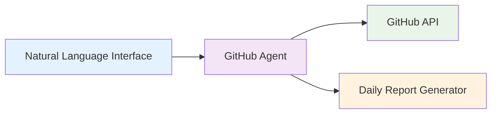

# github-agent
An agent that enables Project Managers to interact with GitHub using natural language commands and queries.

## Architecture

```mermaid
graph LR
    A[Natural Language Interface] --> B[GitHub Agent]
    B --> C[GitHub API]
    B --> D[Daily Report Generator]
    
    style A fill:#e3f2fd
    style B fill:#f3e5f5
    style C fill:#e8f5e8
    style D fill:#fff3e0
```
