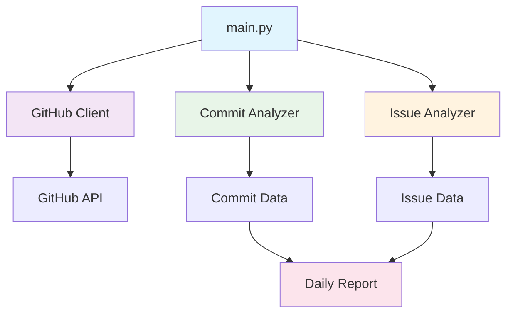

# GitHub Daily Report

Analyzes GitHub repositories to generate daily activity reports including commits and issues.

## Architecture



## Setup

1. Install dependencies:
   ```bash
   pip install -r requirements.txt
   ```

2. Configure GitHub token in `main.py`

3. Run analysis:
   ```bash
   python main.py
   ```

## Components

- `commit_analyzer.py` - Analyzes repository commits
- `issue_analyzer.py` - Analyzes repository issues
- `github_client.py` - GitHub API client
- `main.py` - Entry point